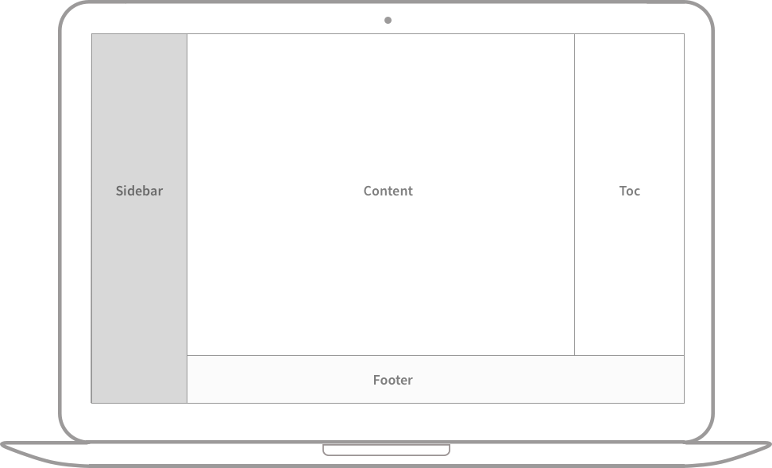
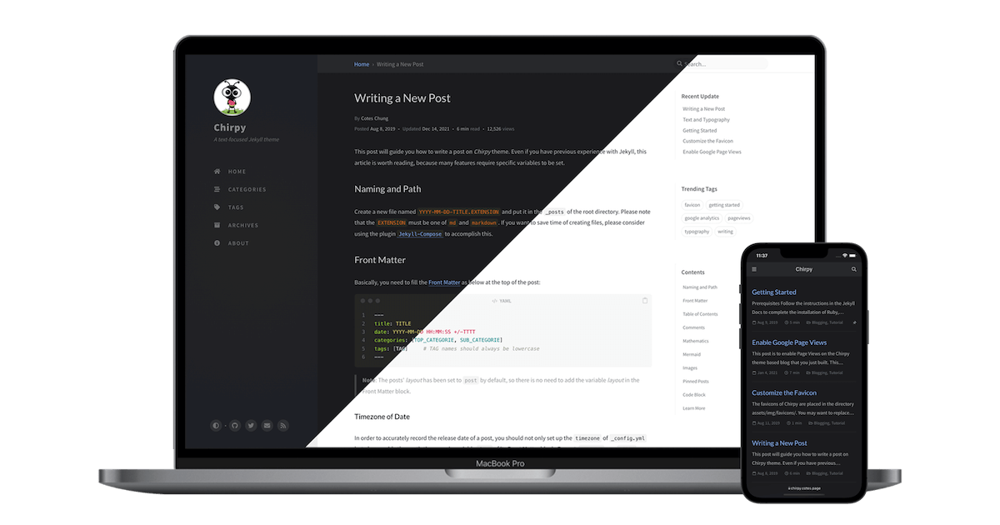

= Примеры текста, типографики и других элементов
:author: Cotes Chung
:revdate: 2019-08-08
:last-update-date: 2024-07-02
:toc:
:lang: ru

Примеры текста, типографики, математических уравнений, диаграмм, блок-схем, изображений, видео и многого другого.

== Заголовки

=== H1 -- заголовок

==== H2 -- заголовок

===== H3 -- заголовок

====== H4 -- заголовок

== Параграф

Quisque egestas convallis ipsum, ut sollicitudin risus tincidunt a. Maecenas interdum malesuada egestas. Duis consectetur porta risus, sit amet vulputate urna facilisis ac. Phasellus semper dui non purus ultrices sodales. Aliquam ante lorem, ornare a feugiat ac, finibus nec mauris. Vivamus ut tristique nisi. Sed vel leo vulputate, efficitur risus non, posuere mi. Nullam tincidunt bibendum rutrum. Proin commodo ornare sapien. Vivamus interdum diam sed sapien blandit, sit amet aliquam risus mattis. Nullam arcu turpis, mollis quis laoreet at, placerat id nibh. Suspendisse venenatis eros eros.

== Списки

=== Нумерованный список

. Во-первых
. Во-вторых
. В-третьих

=== Маркированный список

* Глава
* Раздел
* Параграф

=== Список задач (ToDo)

* [ ] Задача
* [x] Шаг 1
* [x] Шаг 2
* [ ] Шаг 3

=== Список определений

Солнце:: звезда, вокруг которой вращается Земля.
Луна:: естественный спутник Земли, видимый благодаря отраженному солнечному свету.

== Цитата

[quote]
____
Эта строка показывает цитату.
____

== Уведомления (Prompts)

[TIP]
====
Пример уведомления типа "совет" (tip).
====

[NOTE]
====
Пример уведомления типа "информация" (info).
====

[WARNING]
====
Пример уведомления типа "предупреждение" (warning).
====

[CAUTION]
====
Пример уведомления типа "опасность" (danger).
====

== Таблицы

[cols="1,1,1", options="header"]
|===
| Компания | Контакт | Страна
| Продуктовый магазин Альфреда | Мария Андерс | Германия
| Island Trading | Хелен Беннетт | Великобритания
| Magazzini Alimentari Riuniti | Джованни Ровелли | Италия
|===

== Ссылки

link:http://127.0.0.1:4000[http://127.0.0.1:4000]

== Сноски

Нажмите на ссылку, чтобы перейти к сноскеfootnote:[Это первая сноска.], а вот и другая сноскаfootnote:[Это вторая сноска.].

== Встроенный код

Это пример `встроенного кода`.

=== Путь к файлу

Вот пример пути к файлу: `/path/to/the/file.extend`.

== Блоки кода

=== Обычный код

[source]
----
Это обычный фрагмент кода, без подсветки синтаксиса и номеров строк.
----

=== С указанием языка

[source,bash]
----
if [ $? -ne 0 ]; then
  echo "The command was not successful.";
  #do the needful / exit
fi;
----

=== С указанием имени файла

[source,scss,title="main.scss"]
----
@import
  "colors/light-typography",
  "colors/dark-typography";
----

== Математика

Математические формулы отображаются с помощью MathJax:

stem:[\label{eq:sample} E = mc^2]

Мы можем сослаться на уравнение как <<eq:sample>>.

Когда stem:[a \ne 0], уравнение stem:[ax^2 + bx + c = 0] имеет два решения:

stem:[x = {-b \pm \sqrt{b^2-4ac} \over 2a}]

== Диаграммы Mermaid SVG

==== Диаграмма Ганта

[mermaid]
....
gantt
    title Добавление диаграммы Ганта в mermaid
    dateFormat  YYYY-MM-DD
    section Секция А
    Завершенная задача   :done,    des1, 2014-01-06,2014-01-08
    Активная задача      :active,  des2, 2014-01-09, 3d
    Будущая задача       :         des3, after des2, 5d
    Еще одна задача      :         des4, after des3, 5d
....

== Изображения

=== По умолчанию (с подписью)

image:./img/Default (with caption).png[Подпись к изображению] +

=== На всю ширину и по центру

image:./img/Default (with caption).png[Подпись, align=center, width=100%] +

=== Выравнивание по левому краю

=== Обтекание слева (Float to left)

image:./img/Float to left.png[float=left, width=300]

=== Обтекание справа (Float to right)

image:./img/Float to right.png[float=right, width=300]

=== Темный/Светлый режим и тень

Изображение ниже будет переключаться между темным и светлым режимом в зависимости от темы. Обратите внимание на тень.

