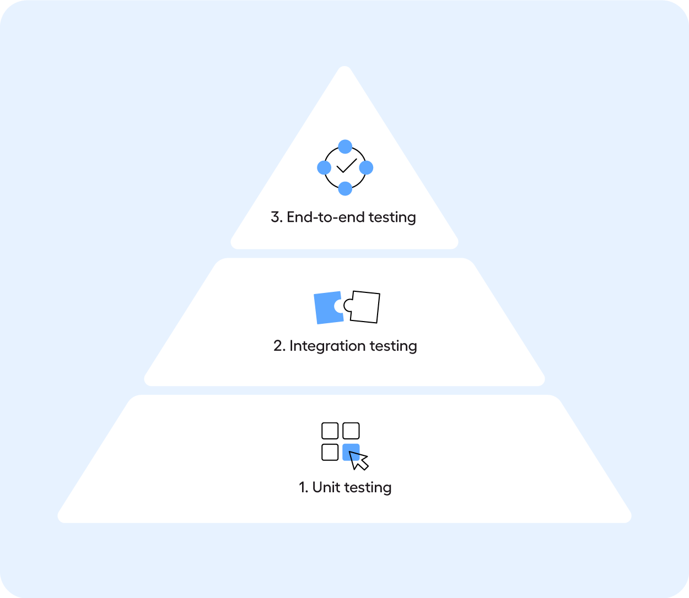

= Урок 1: Пирамида тестирования и классификация тестов в iOS
:sectnums:
:source-highlighter: highlight.js

== Цели урока

* Изучить концепцию пирамиды тестирования (`Unit`, `Integration`, `End-to-End`).
* Классифицировать различные виды тестов в iOS-разработкеw.
* Понять место каждого вида тестов в пирамиде, их назначение и способы реализации на Swift.

---

== Теория

=== Пирамида тестирования

Пирамида тестирования — это модель, которая помогает выстроить сбалансированную и эффективную стратегию автоматизированного тестирования. Основная идея: чем выше уровень теста в пирамиде, тем он медленнее, дороже и более хрупкий, а значит, таких тестов должно быть меньше.

[.text-center]

* *End-to-End (E2E) тесты (Вершина пирамиды):*
** **Что делают:** Проверяют всю систему целиком, от пользовательского интерфейса до базы данных. Имитируют путь реального пользователя.
** **Характеристики:** Медленные, дорогие в написании и поддержке, хрупкие (могут падать из-за незначительных изменений в UI).
** **Количество:** Минимальное. Покрывают только самые критичные бизнес-сценарии (например, "пользователь может залогиниться, добавить товар в корзину и оформить заказ").

* *Интеграционные тесты (Середина):*
** **Что делают:** Проверяют взаимодействие нескольких компонентов системы. Они отвечают на вопрос: "Работают ли наши модули вместе?".
** **Характеристики:** Быстрее E2E-тестов, но медленнее Unit-тестов.
** **Количество:** Больше, чем E2E, но значительно меньше, чем Unit-тестов.

* *Unit-тесты (Основание пирамиды):*
** **Что делают:** Проверяют наименьшую изолированную часть кода — "юнит" (функцию, метод, класс). Они отвечают на вопрос: "Делает ли этот конкретный фрагмент кода то, что от него ожидается?".
** **Характеристики:** Очень быстрые, стабильные и дешевые. Точно локализуют ошибку.
** **Количество:** Максимальное. Это фундамент качества вашего приложения.

=== Классификация тестов в iOS

Давай разберемся, куда в этой пирамиде ложатся конкретные виды тестов, с которыми ты столкнешься.

. *Unit-тесты для бизнес-логики*
** **Место в пирамиде:** Основание (Unit).
** **Что это:** Тесты, проверяющие "мозги" приложения: модели, сервисы, `ViewModel`, различные хелперы и утилиты. Они работают без запуска UI и симулятора.
** **Как разрабатываются:** Используется фреймворк `XCTest`. Тесты пишутся для классов и структур, проверяя их публичные методы. Зависимости (например, сетевые клиенты) подменяются моками или стабами.

. *Unit-тесты для UI*
** **Место в пирамиде:** Основание (Unit), но на границе с интеграционными.
** **Что это:** Тесты, которые проверяют логику UI-компонентов (`UIViewController`, `UIView`) в изоляции. Например, что при вызове определенного метода кнопка становится неактивной, а `UILabel` меняет текст. Они также могут выполняться без полного запуска приложения.
** **Как разрабатываются:** Используется `XCTest`. Создается экземпляр `UIViewController`, его `view` загружается в память (`loadViewIfNeeded()`), после чего можно проверять состояние его элементов.

. *Snapshot-тесты*
** **Место в пирамиде:** Основание (Unit) / Середина (Интеграционные).
** **Что это:** Тесты, которые делают "скриншот" отдельного UI-компонента (`UIView`) или целого экрана (`UIViewController`) и сравнивают его с эталонным изображением. Это быстрый способ отловить визуальные регрессии (например, "кнопка съехала на 5 пикселей").
** **Как разрабатываются:** Используются сторонние библиотеки, например, `SnapshotTesting` от Point-Free. Тест рендерит `view` и сравнивает получившееся изображение с сохраненным эталоном.

. *API-тесты*
** **Место в пирамиде:** Середина (Интеграционные).
** **Что это:** Тесты, которые проверяют взаимодействие вашего приложения с бэкендом. Они отправляют реальные сетевые запросы к API и проверяют, что ответы (коды состояния, JSON-тела) соответствуют ожиданиям.
** **Как разрабатываются:** Можно использовать `XCTest` вместе с `URLSession` или `Alamofire`. Тесты создают сетевой запрос, дожидаются ответа (с помощью `XCTestExpectation`) и проверяют его содержимое.

. *UI-тесты (нативные)*
** **Место в пирамиде:** Вершина (End-to-End).
** **Что это:** Тесты, которые запускают приложение в симуляторе или на реальном устройстве и имитируют действия пользователя: нажатия, свайпы, ввод текста. Они проверяют сквозные пользовательские сценарии.
** **Как разрабатываются:** Используется фреймворк `XCUITest`. Тесты взаимодействуют с приложением "снаружи", находя элементы по их идентификаторам (`accessibilityIdentifier`) и выполняя с ними действия.

. *Appium-тесты*
** **Место в пирамиде:** Вершина (End-to-End).
** **Что это:** Это те же UI-тесты, но написанные с использованием кросс-платформенного фреймворка Appium. Они позволяют писать тесты на разных языках (Java, Python, JS) и потенциально переиспользовать их для Android.
** **Как разрабатываются:** Устанавливается Appium-сервер. Тесты пишутся на выбранном языке (например, Python + `pytest`), которые отправляют команды на Appium-сервер, а тот, в свою очередь, транслирует их в команды для `XCUITest` "под капотом".

. *Инструментальные тесты*
** **Место в пирамиде:** Охватывают все уровни.
** **Что это:** Это общий термин, который в контексте iOS/Android означает тесты, требующие для своего запуска симулятор или реальное устройство.
** **Классификация в Swift/iOS:**
*** *Unit-тесты* (`XCTest`) для чистой бизнес-логики обычно не являются инструментальными, так как могут работать без симулятора.
*** *UI-тесты* (`XCUITest`), *Snapshot-тесты*, *Unit-тесты для UI* — это всё **инструментальные тесты**, потому что им нужен запущенный рантайм iOS для рендеринга UI-компонентов или всего приложения.